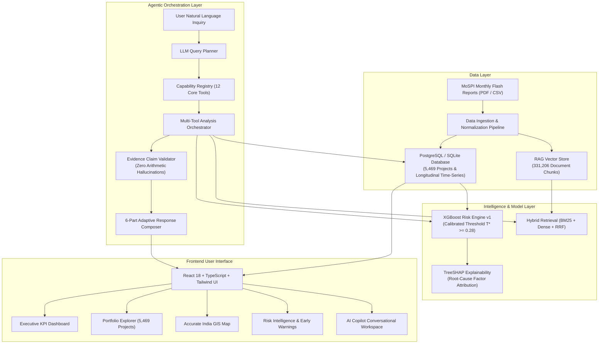

<div align="center">

# 🏗️ Nirman AI (निर्माण AI)
### Autonomous Infrastructure Risk Intelligence & Predictive Surveillance Platform

[](https://fastapi.tiangolo.com/)
[](https://reactjs.org/)
[](https://vitejs.dev/)
[](https://tailwindcss.com/)
[](https://xgboost.ai/)
[](https://www.python.org/)
[](https://www.postgresql.org/)

<p align="center">
  <b>Transforming national infrastructure monitoring from static monthly PDF reports into an active, evidence-grounded predictive intelligence platform.</b>
</p>

</div>

---

## 📌 Problem Statement & Context

India’s **Ministry of Statistics and Programme Implementation (MoSPI)** monitors thousands of central sector infrastructure projects (valued at ₹150+ Crore each) across Railways, Road Transport & Highways, Petroleum, Power, Urban Development, and Mining.

Traditionally, project surveillance depended on 500+ page monthly PDF Flash Reports. This led to:
* **Reactive Bottlenecks**: Cost overruns and schedule slippages were identified months after delays originated.
* **Massive Financial Scale**: Over **₹44.17 Lakh Crore** in capital investments across **5,400+ projects** lacked unified, real-time queryable telemetry.
* **Lack of Root-Cause Explainability**: Decisions lacked empirical machine learning models capable of isolating primary risk drivers.

**Nirman AI** unifies multi-source longitudinal project telemetry, machine learning risk forecasting, hybrid document retrieval, dynamic query planning, and interactive geospatial mapping into an enterprise-grade command center.

---

## 🌟 Key Platform Capabilities

### 1. 🤖 Nirman AI Copilot v2 (Autonomous Intelligence Layer)
* **Dynamic Query Planner**: Translates arbitrary natural language inquiries into validated execution plans across 12 discrete backend capabilities.
* **Multi-Tool Orchestrator**: Executes queries deterministically via Python services without exposing raw unconstrained SQL execution.
* **Evidence Claim Validator**: Audits generated statements and numbers against database ground-truth claims to eliminate arithmetic hallucinations.
* **Standardized 6-Part Output**: Formats responses with Direct Answer, Key Findings, Important Numbers, Root Drivers, Verifiable Citations (`[E1]`, `[E2]`), and Interactive Action Chips.

### 2. ⚡ XGBoost Machine Learning Risk Engine v1
* **Predictive Risk Classification**: Predicts cost expansion and timeline slippage probability before critical milestones fail, stratifying projects into **Critical, High, Moderate, and Low** risk tiers ($T^* \ge 0.28$).
* **SHAP Explainability**: Decomposes individual project predictions into exact percentage driver contributions (e.g., *Land Acquisition: 34%, Contractor Cashflow: 28%, Forestry Clearance: 19%*).

### 3. 🔍 Hybrid RAG Knowledge Engine
* **331,000+ Chunk Vector Store**: Indexes text from Flash Reports, project minutes, and official records.
* **Reciprocal Rank Fusion (RRF)**: Blends sparse keyword matching (BM25) with dense semantic embeddings to deliver grounded, citation-backed textual evidence.

### 4. 🗺️ Official Survey-Accurate India Geospatial Map
* **Accurate Geographic Boundaries**: High-resolution vector paths matching official Survey of India boundaries across all 28 States and 8 Union Territories (including complete borders for Ladakh, Jammu & Kashmir, Arunachal Pradesh, Northeast States, and Island territories).
* **Dynamic Choropleth Modes**: Heatmap toggles for **Risk Exposure**, **Cost Overrun (₹ Cr)**, **Average Delay (Months)**, and **Total Projects**.
* **Interactive Telemetry**: Real-time state hover cards and click-to-filter drilldowns.

### 5. 📊 Live Infrastructure Portfolio Explorer
* **Complete Database Coverage**: Real-time search and filter across all **5,469 projects** (no artificial 100-item caps).
* **Multi-Parameter Filtering**: Filter by Sector, State, Risk Category, Cost Range, and Delay Duration with server-side pagination.

---

## 🏛️ System Architecture



---

## 🛠️ Tech Stack

| Layer | Technologies |
| :--- | :--- |
| **Frontend** | React 18, TypeScript, Vite, Tailwind CSS, Lucide Icons |
| **Backend** | FastAPI, Uvicorn, Pydantic v2, Python 3.10+ |
| **Database** | PostgreSQL, SQLite, SQLAlchemy, Parquet |
| **Machine Learning** | XGBoost, Scikit-Learn, LightGBM, SHAP, Joblib, NLTK |
| **Search & Retrieval** | BM25, TF-IDF Dense SVD Vector Embeddings, Reciprocal Rank Fusion (RRF) |
| **LLM & AI** | Google Gemini API (`gemini-2.5-flash`), Custom Dynamic Query Planner |

---

## 🚀 Quickstart & Setup Guide

### 1. Clone the Repository
```bash
git clone https://github.com/sanket-gayakhe/NirmanAI.git
cd NirmanAI
```

### 2. Environment Configuration
Copy the template configuration and set your Gemini API key:
```bash
cp .env.example .env
```
Edit `.env`:
```env
DB_USER=postgres
DB_PASSWORD=your_password
DB_NAME=nirman_db
DB_HOST=localhost
DB_PORT=5432

GEMINI_API_KEY=your_gemini_api_key_here
GEMINI_MODEL=gemini-2.5-flash
```

### 3. Backend Setup
```bash
# Create and activate virtual environment
python3 -m venv .venv
source .venv/bin/activate  # On Windows: .venv\Scripts\activate

# Install dependencies
pip install -r backend/requirements.txt
```

### 4. Frontend Setup
```bash
cd frontend
npm install
npm run build
cd ..
```

### 5. Launch the Platform
Start the unified application (FastAPI backend + Vite frontend):
```bash
python3 start_server.py
```
* **Web UI**: Open [http://localhost:5173](http://localhost:5173) in your browser.
* **API Documentation**: Open [http://localhost:8000/docs](http://localhost:8000/docs) (Swagger UI).

---

## 🧪 Testing & Verification

Nirman AI includes a comprehensive acceptance test harness:

```bash
# Run Master Acceptance Test Harness
python3 scripts/testing/run_full_acceptance.py

# Run AI Copilot v2 Intelligence Evaluation (Categories A-K)
python3 scripts/testing/test_copilot_v2_eval.py
```

### Acceptance Matrix Summary:
* ✅ **AI Copilot Intelligence (Categories A–K)**: 11 / 11 Passed
* ✅ **Database & Ingestion Integrity**: 17 / 17 Passed
* ✅ **XGBoost Risk Engine & SHAP**: 5 / 5 Passed
* ✅ **RAG Hybrid Search & RRF**: 6 / 6 Passed
* ✅ **REST API Contracts**: 22 / 22 Passed
* ✅ **Frontend React Build**: 0 Errors (`tsc && vite build`)

---

## 📂 Project Directory Structure

```
NirmanAI/
├── backend/
│   ├── app/
│   │   ├── core/              # DB resilience & logging configuration
│   │   ├── routes/            # REST API endpoints (analytics, projects, assistant, risk)
│   │   ├── schemas/           # Pydantic validation schemas
│   │   └── services/          # Business logic (query planner, risk engine, RAG, orchestrator)
│   ├── models/                # Embedding & vector models
│   └── requirements.txt       # Python dependencies
├── database/
│   ├── schema.sql             # Relational database schema
│   └── nirman.db              # Seed SQLite database
├── documentation/             # Architectural & phase-wise documentation
├── frontend/
│   ├── src/
│   │   ├── components/
│   │   │   ├── analytics/     # India Map SVG & GIS path definitions
│   │   │   ├── assistant/     # AI Copilot drawer & chat cards
│   │   │   ├── dashboard/     # Executive overview & KPIs
│   │   │   └── portfolio/     # Full-database project explorer & comparison
│   │   ├── services/          # Axios API clients
│   │   └── types/             # TypeScript interfaces
│   └── package.json           # Frontend dependencies
├── models/                    # Trained ML artifacts (XGBoost, Random Forest, LightGBM)
├── processed/                 # Engineered feature datasets & inventory manifests
├── scripts/                   # Data extraction, training, and testing suites
├── start_server.py            # Unified server launcher
├── .env.example               # Environment variables template
└── .gitignore                 # Git ignore rules
```

---

## 📄 License
This project was developed for the **Smart India Hackathon (SIH)** under MoSPI infrastructure monitoring guidelines.

---

<div align="center">
  <b>Empowering transparent, predictive, and data-driven infrastructure governance.</b>
</div>
